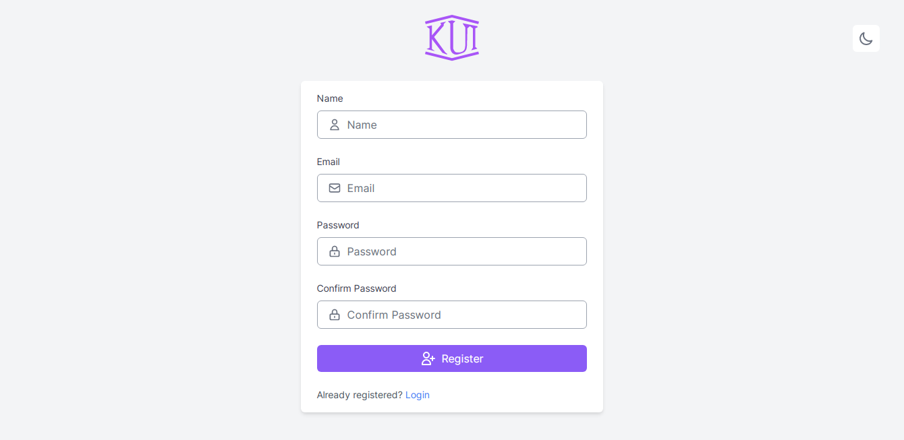
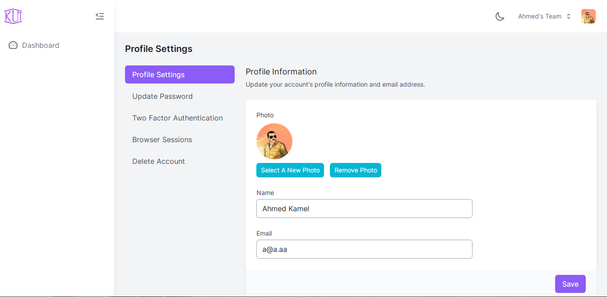
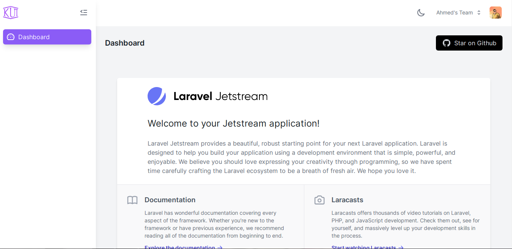
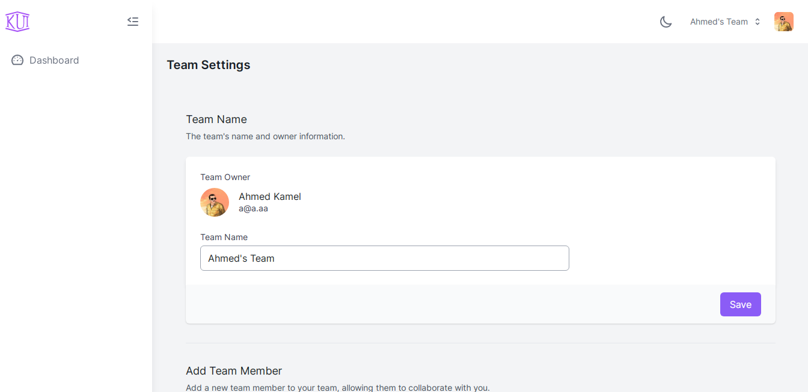
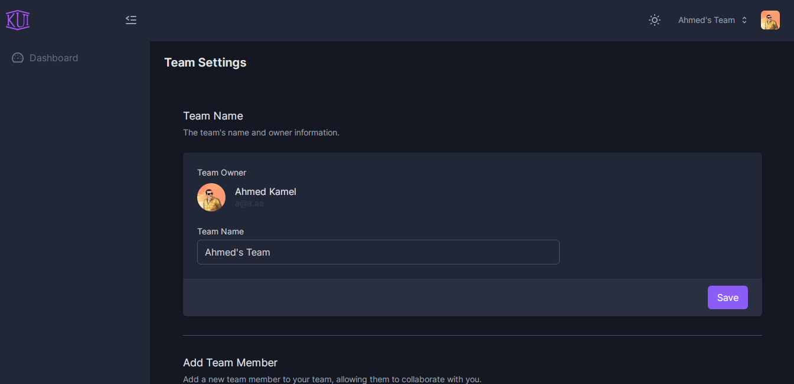
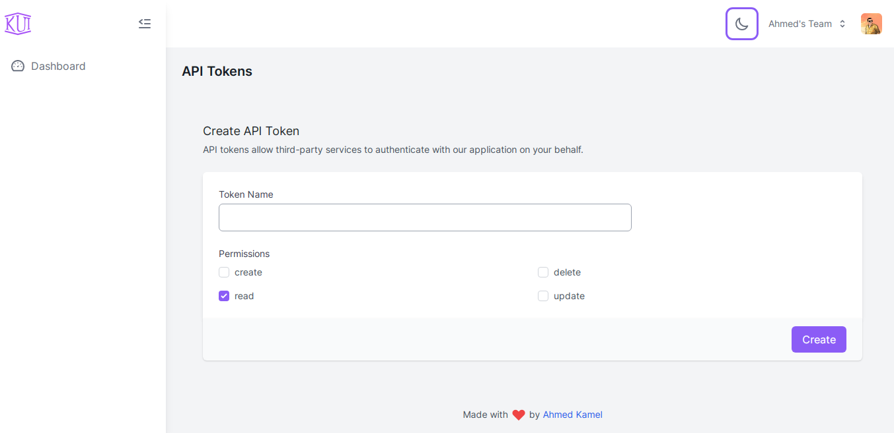
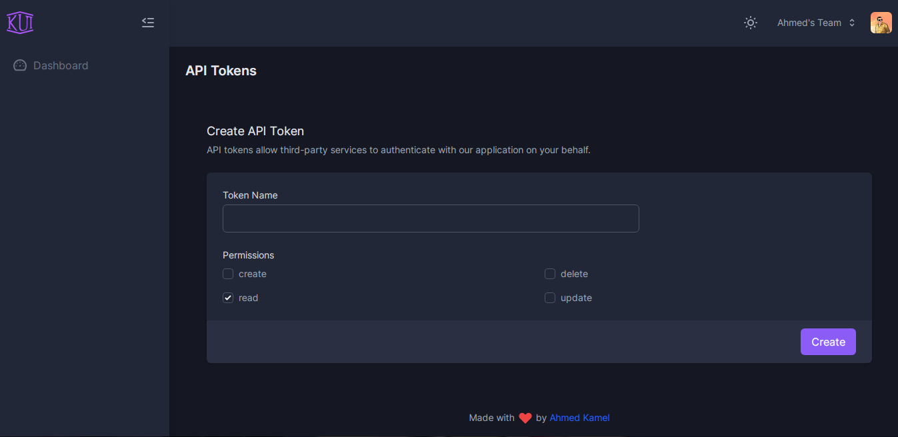

# K UI Jetstream starter

Different UI for [larave/jeststream](https://github.com/laravel/jeststream).

[](https://github.com/Kamona-WD/kui-laravel-jetstream/blob/main/LICENSE.md)
[](https://github.com/Kamona-WD/kui-laravel-jetstream/releases)
[](https://github.com/Kamona-WD/kui-laravel-jetstream/stargazers)
[](https://packagist.org/packages/kamona/kui-laravel-jetstream)

#### [Breeze Version](https://github.com/Kamona-WD/kui-laravel-breeze)

#### Note

We recommend installing this package on a project that you are starting from scratch.

#### Usage

1. Fresh install Laravel >= 8.0 and `cd` to your app.
2. Install laravel/jetstream

```sh
composer require laravel/jetstream

# after finish run this command

php artisan jetstream:install livewire --teams
```

3. Install kamona/kui-laravel-jetstream

```sh
composer require kamona/kui-laravel-jetstream --dev

# after finish run this command

php artisan kui-jetstream:replace livewire
# available stacks (livewire,inertia).
# So if you run `php artisan jetstream:install inertia` you can run `php artisan kui-jetstream:replace inertia`

# then
npm install && npm run dev # or yarn && yarn dev
```

4. Configure your database.
5. Run `php artisan migrate`.
6. `npm install && npm run dev`
7. `php artisan serve`

> Do not change `APP_URL` in `.emv` file and run `php artisan storage:link` if you want to enable `manageProfilePicture` feature.

#### Navigation

You will found sidebar links in:

- livewirw: `resources/views/components/sidebar/content.blade.php`.
- inertia: `resources/js/Components/Sidebar/SidebarContent.vue`

#### Screens

|                                     |                                    |
| ----------------------------------- | ---------------------------------- |
|    |    |
|    |    |
|    |    |
|    |    |
|  |  |
