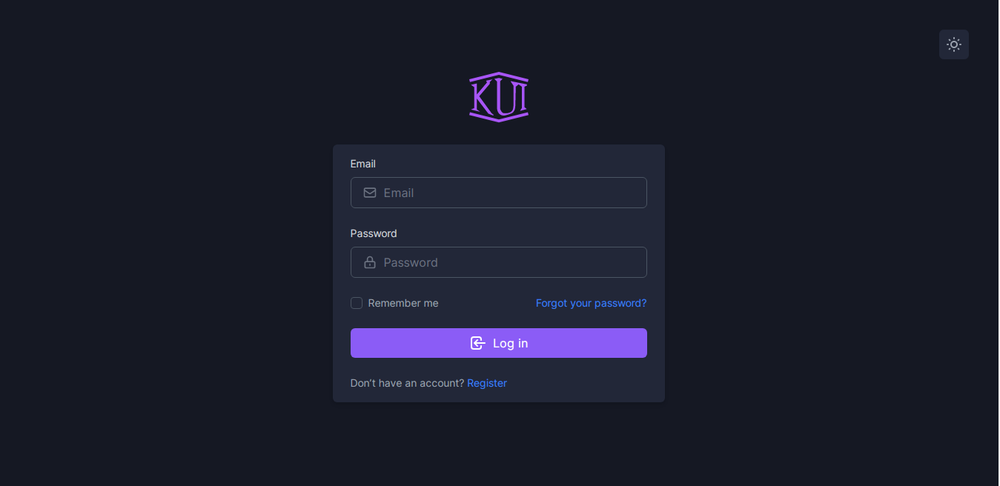
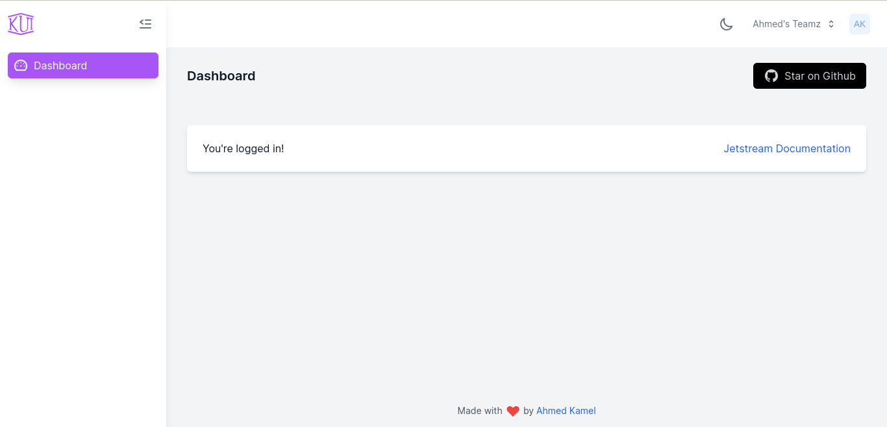
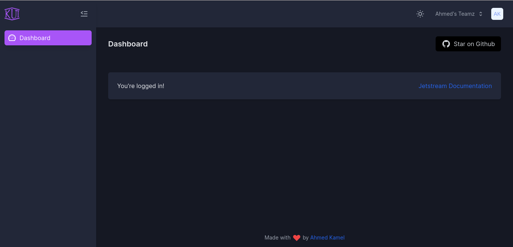
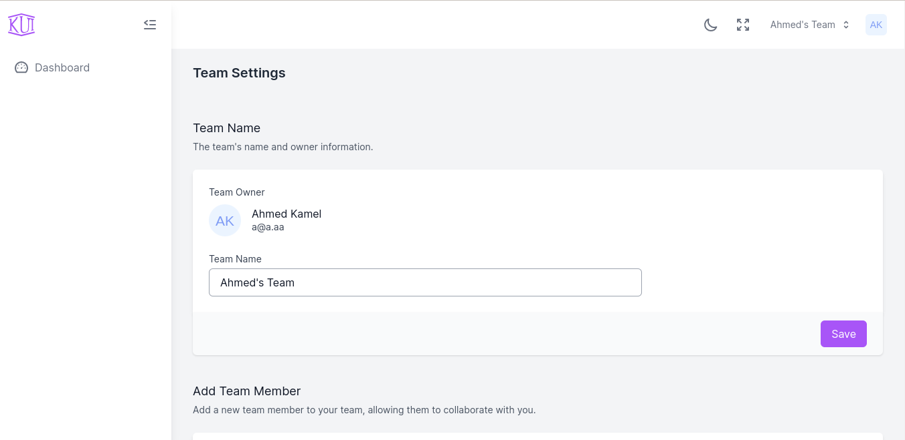
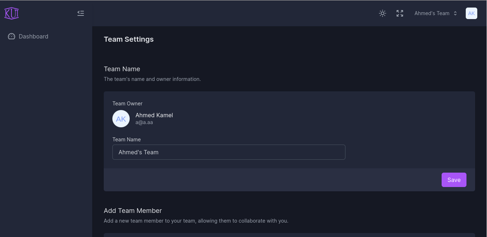
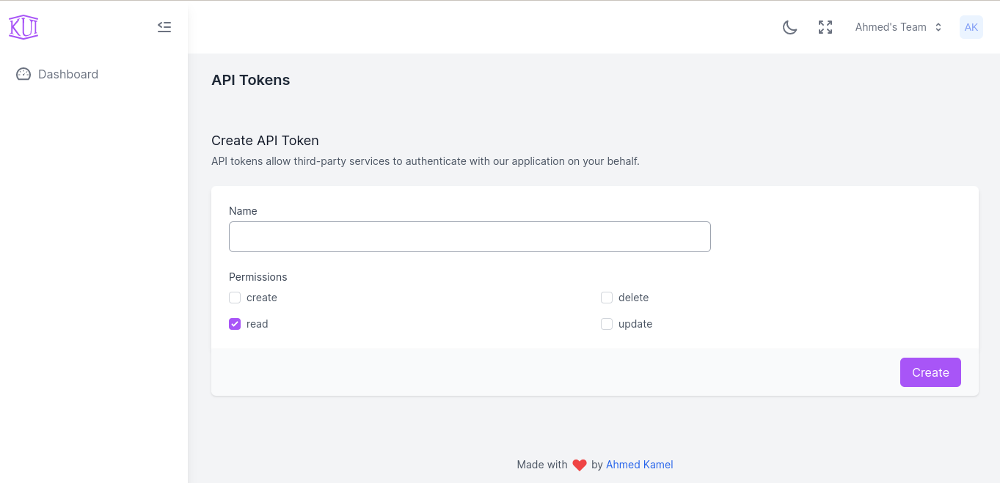
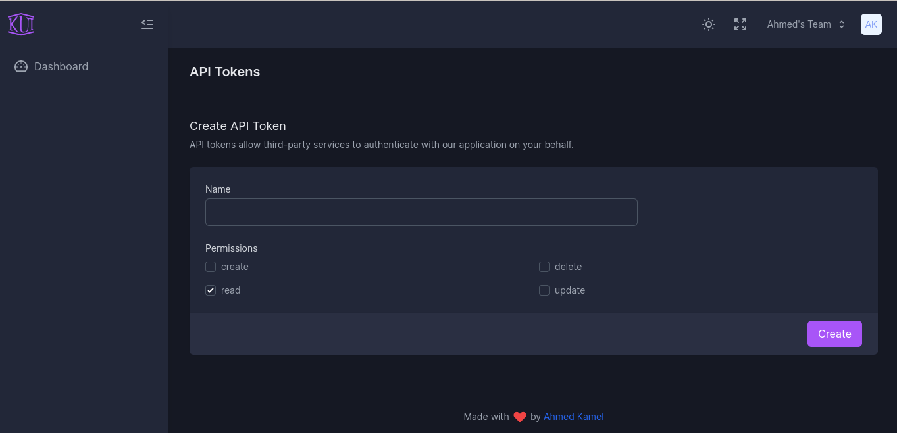

# K UI Laravel Jetstream

Different UI for [larave/jetstream](https://github.com/laravel/jetstream).

[](https://github.com/Kamona-WD/kui-laravel-jetstream/blob/main/LICENSE.md)
[](https://github.com/Kamona-WD/kui-laravel-jetstream/releases)
[](https://github.com/Kamona-WD/kui-laravel-jetstream/stargazers)
[](https://packagist.org/packages/kamona/kui-laravel-jetstream)

#### [Breeze Version](https://github.com/Kamona-WD/kui-laravel-breeze)
<!-- #### [Fortify Version](https://github.com/Kamona-WD/kui-laravel-fortify) -->


> We recommend installing this package on a project that you are starting from scratch.

#### Usage
> NOTE: It doesn't matter if you use `vitejs` or `laravel-mix`, it will work in both cases.
1. Fresh install Laravel >= 8.0 and `cd` to your app.
2. Install laravel/jetstream

```sh
composer require laravel/jetstream

# after finish run this command

php artisan jetstream:install livewire --teams
```

3. Install kamona/kui-laravel-jetstream

```sh
composer require kamona/kui-laravel-jetstream --dev

# after finish run this command

# This package will detect if your project use vitejs or not by check if vite.config.js exist or not.
php artisan kui-jetstream:replace livewire --teams
# available stacks (livewire,inertia).
# So if you run `php artisan jetstream:install inertia` you can run `php artisan kui-jetstream:replace inertia`

# then
npm install && npm run dev # or yarn && yarn dev
```

4. Configure your database.
5. Run `php artisan migrate`.
6. `php artisan serve`.

> Do not forget to change `APP_URL` in `.env` file and run `php artisan storage:link` if you want to enable `manageProfilePicture` feature.

#### Navigation

You will found sidebar links in:

- livewire: `resources/views/components/sidebar/content.blade.php`.
- inertia: `resources/js/Components/Sidebar/SidebarContent.vue`

#### Screens

|                                     |                                    |
| ----------------------------------- | ---------------------------------- |
|    |    |
|    |    |
|    |    |
|  |  |
